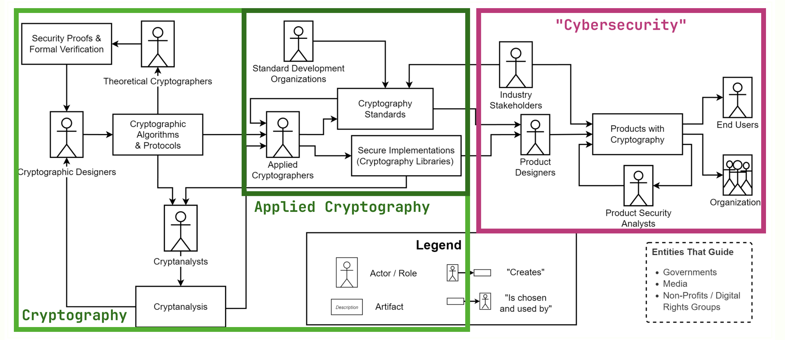
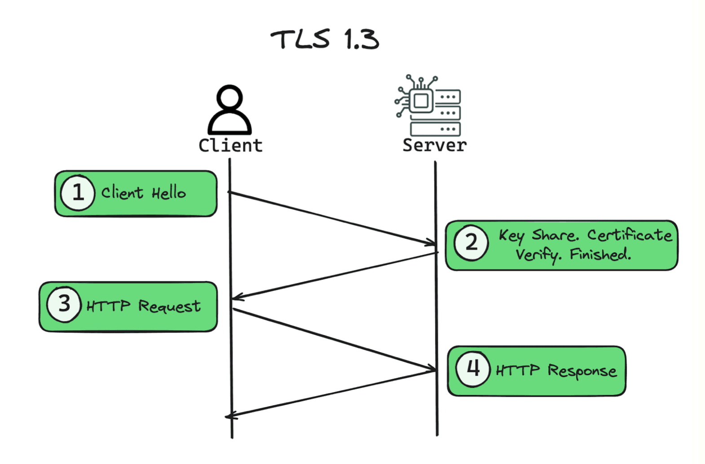

# Applied Cryptography: Giới thiệu

## I. Tổng quan Khóa học

Khóa học Mật mã học Ứng dụng này cung cấp một cách tiếp cận toàn diện để hiểu cả nền tảng lý thuyết và ứng dụng thực tế của mật mã học hiện đại. Được thiết kế cho sinh viên đại học và sau đại học, khóa học tập trung vào bảo mật có thể chứng minh và cách các nguyên lý mật mã học được triển khai trong các hệ thống thế giới thực.

### 1. Mục tiêu Khóa học

Khóa học này nhằm mục đích:

- Hiểu lý luận đằng sau toán học của mật mã học hiện đại

- Phân tích và chứng minh tính bảo mật của các cấu trúc mật mã

- Hiểu cách các cấu trúc mật mã có thể được kết hợp để xây dựng các giao thức và hệ thống bảo mật trong thế giới thực

- Phân biệt giữa mật mã học lý thuyết và mật mã học ứng dụng từ góc độ kỹ thuật

- Đánh giá nghiêm túc các triển khai bảo mật và đánh giá các giao thức mật mã trong thế giới thực

- Hiểu biết về tương lai của mật mã học và vai trò của nó trong các công nghệ mới nổi

## II. Khái niệm Chính

### 1. Định nghĩa Mật mã học

Mật mã học được định nghĩa là **"khoa học cho phép tính toán, giao tiếp, xác minh và ủy quyền an toàn và riêng tư trong sự hiện diện của các bên không đáng tin cậy, hành vi đối nghịch và những người tham gia không tin tưởng lẫn nhau."** Định nghĩa này nhấn mạnh tính chất đa chiều của mật mã học hiện đại, vượt ra ngoài việc chỉ mã hóa dữ liệu.

### 2. Tính phổ biến của Mật mã học

Mật mã học đã trở thành một phần không thể thiếu trong cuộc sống số hàng ngày. Một chiếc điện thoại thông minh trung bình thực hiện hơn 100 hoạt động mật mã mỗi giây, bao gồm:

- Kết nối WiFi (WPA3)
- Kết nối di động (5G AES)
- Thông báo ứng dụng (TLS)
- Face/Touch ID (Secure Enclave)
- Làm mới ứng dụng trong nền

Trong một lớp học 75 phút, các thiết bị của học sinh thực hiện hơn 450,000 hoạt động mật mã, và đến cuối học kỳ, con số này lên đến hàng tỷ hoạt động.

### 3. Mục tiêu Bảo mật

Mật mã học nhằm đạt được ba mục tiêu bảo mật cơ bản:

- Bảo mật (Confidentiality): Dữ liệu được trao đổi giữa các bên chỉ được biết bởi những bên đó
- Xác thực (Authentication): Nếu Server nhận dữ liệu từ Client, thì Client đã gửi nó cho Server
- Tính toàn vẹn (Integrity): Nếu Server sửa đổi dữ liệu thuộc về Client, Client có thể phát hiện ra

### 4. Giải thích Chi tiết

#### 4.1. Khối xây dựng Mật mã

#### 4.2. Nguyên thủy và Giao thức

Mật mã học thể hiện dưới dạng một tập hợp các nguyên thủy, từ đó chúng ta xây dựng các giao thức nhằm đạt được các mục tiêu bảo mật được xác định rõ ràng.
**Nguyên thủy bao gồm:**

- AES (Advanced Encryption Standard)
- RSA (Rivest-Shamir-Adleman)
- SHA-2 (Secure Hash Algorithm 2)
- DH (Diffie-Hellman)

**Giao thức bao gồm:**

- TLS (Transport Layer Security)
- Signal Protocol
- SSH (Secure Shell)
- FileVault 2, BitLocker

#### 4.3. Bài toán Khó

Mật mã học chủ yếu dựa trên việc đặt tính bảo mật của một hệ thống tương đương với độ khó của việc giải một bài toán toán học được cho là rất tốn kém về mặt tính toán. Điều này cho phép chúng ta có các hệ thống bảo mật mà chúng ta có thể chứng minh toán học là an toàn (dưới các giả định).

**Bài toán Logarit Rời rạc (DLP) là một ví dụ cơ bản:**

- Cho một nhóm cyclic hữu hạn \(G\), một phần tử sinh \(g \in G\), và một phần tử \(h \in G\)
- Tìm số nguyên \(x\) sao cho \(g^x = h\)
- Bài toán này được cho là khó về mặt tính toán khi các tham số đủ lớn

#### 4.4. Nguyên thủy Đối xứng và Bất đối xứng

##### Bất đối xứng

- Ví dụ: Diffie-Hellman, RSA, ML-KEM
- "Bất đối xứng" vì có "khóa công khai" và "khóa riêng" cho mỗi bên
- Dựa trên đại số, giả định độ khó của các bài toán toán học

##### Đối xứng

- Ví dụ: AES, SHA-2, ChaCha20, HMAC
- "Đối xứng" vì có một khóa bí mật
- Không dựa trên đại số có cấu trúc; dựa vào khả năng chống lại nhiều năm phân tích mật mã

#### 4.5. Nguyên lý Kerckhoffs

> Nguyên lý (Auguste Kerckhoffs, 1883): "Một hệ thống mật mã nên an toàn ngay cả khi mọi thứ về hệ thống, ngoại trừ khóa, đều được biết công khai."

Tầm quan trọng:

- Không có "bảo mật thông qua che giấu"
- Khóa là bí mật duy nhất: phần còn lại có thể được kiểm toán, thử nghiệm, tin cậy
- Khuyến khích các tiêu chuẩn mở và đánh giá đồng đẳng
- Nếu tính bảo mật phụ thuộc vào việc không ai biết nó hoạt động ra sao, thì nó không an toàn

#### 4.6. Ví dụ / Ứng dụng

##### Trao đổi Khóa Diffie-Hellman: "Phép thuật thực sự"

Một ví dụ nổi bật về sức mạnh của mật mã học là giao thức trao đổi khóa Diffie-Hellman, cho phép hai bên thiết lập một bí mật chung ngay cả khi có kẻ nghe trộm.

**Thiết lập:**

- Tham số công khai: \(p = 13\), \(g = 2\)
- Alice chọn bí mật: \(a = 5\)
- Bob chọn bí mật: \(b = 7\)

**Trao đổi công khai:**

- Alice tính: \(A = g^a \bmod p = 6\)
- Bob tính: \(B = g^b \bmod p = 11\)
- Alice gửi \(A = 6\) cho Bob
- Bob gửi \(B = 11\) cho Alice

**Tính toán bí mật chung:**

- Alice tính: \(s = B^a \bmod p = 11^5 \bmod 13 = 9\)
- Bob tính: \(s = A^b \bmod p = 6^7 \bmod 13 = 9\)
- Bí mật chung: \(s = 9\)

Kẻ nghe trộm chỉ thấy: \(p = 13\), \(g = 2\), \(A = 6\), \(B = 11\) nhưng không thể tính được bí mật chung.

##### Hàm Hash: SHA-256

Hàm hash là một nguyên thủy đối xứng quan trọng với các tính chất:

- Nhận đầu vào có kích thước bất kỳ
- Tạo ra đầu ra có kích thước cố định
- Là xác định (cùng đầu vào → cùng đầu ra)
- Thay đổi nhỏ trong đầu vào tạo ra đầu ra hoàn toàn khác

Ví dụ:

- `SHA256("hello") = 2cf24dba5fb0a30e26e83b2ac5b9e29e1b161e5c1fa7425e73043362938b9824`
- `SHA256("hullo") = 7835066a1457504217688c8f5d06909c6591e0ca78c254ccf17450d0d999cab0`

##### Ứng dụng trong Signal Protocol

Signal sử dụng trao đổi khóa Diffie-Hellman hàng chục, hàng trăm lần mỗi cuộc trò chuyện thông qua:

- Trao đổi khóa ban đầu: sử dụng X3DH (Extended Triple DH)
- Giao tiếp liên tục: sử dụng Double Ratchet với trao đổi khóa DH mới cho mỗi tin nhắn

Điều này cung cấp:

- Forward Secrecy: tin nhắn ngày hôm qua vẫn an toàn nếu điện thoại bị xâm nhập hôm nay
- Post-Compromise Security: tin nhắn ngày mai an toàn trở lại nếu điện thoại hồi phục sau xâm nhập

##### TLS 1.3: Bảo mật Web

TLS 1.3 kết hợp nhiều nguyên thủy mật mã:

- Trao đổi khóa công khai (ví dụ: Diffie-Hellman) để thiết lập bí mật chung
- AES để mã hóa dữ liệu trong quá trình truyền
- SHA-2 để hash (kiểm tra chứng chỉ, v.v.)

Thông qua thiết kế này, chúng ta đạt được các mục tiêu bảo mật mong muốn dưới một mô hình mối đe dọa được chỉ định rõ ràng.

##### Chứng minh Không Kiến thức (Zero-Knowledge Proofs)

Chứng minh không kiến thức cho phép bạn chứng minh rằng bạn biết một bí mật mà không tiết lộ bất kỳ thông tin nào về nó. Một ứng dụng thú vị là trò chơi battleship ZK, nơi server chứng minh với người chơi rằng đầu ra của nó cho các phỏng đoán battleship của họ là chính xác, mà không tiết lộ bất kỳ thông tin bổ sung nào.

## III. Cấu trúc Khóa học

### 1. Dự án Thực hành

Khóa học bao gồm các dự án thực hành hàng tuần với các chủ đề đa dạng:

- Thiết kế Trình quản lý Mật khẩu: xây dựng kho mật khẩu số với bảo vệ mật khẩu chính
- Thiết kế Ứng dụng Nhắn tin Bảo mật: tạo ứng dụng nhắn tin mã hóa đầu cuối
- Mô hình hóa Giao thức với ProVerif: thiết kế và xác minh toán học giao thức giống TLS
- Trò chơi Battleship Không Kiến thức: xây dựng Battleship mà gian lận là không thể về mặt toán học
- Di chuyển Hậu Lượng tử: chuẩn bị hệ thống cho kỷ nguyên máy tính lượng tử
- Khám phá Liên hệ Riêng tư: xây dựng khám phá liên hệ kiểu WhatsApp thực sự riêng tư
- Xác minh Tuổi Bảo vệ Quyền riêng tư: xây dựng kiểm tra ID không theo dõi bạn
- Viên nang Tin nhắn Khóa Thời gian: tạo viên nang thời gian số không thể mở sớm

### 2. Bài tập

Tất cả các bài tập đã có sẵn trên trang web khóa học, được thiết kế để:

- Củng cố và làm sâu sắc hiểu biết về tài liệu bài giảng
- Bao gồm chứng minh lý thuyết và giải quyết vấn đề
- Các tác vụ lập trình ngắn và thí nghiệm tính toán
- Kết nối các khái niệm trừu tượng với ứng dụng cụ thể