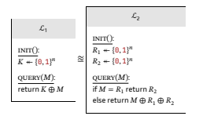
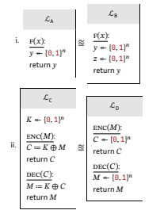

# Problem Set 1: Provable Security Foundations

## Problem Set 1: Nền tảng An ninh Chứng minh được

### 1. (10 điểm) Các khái niệm cơ bản

**(a) (3 điểm)** Định nghĩa ba mục tiêu an ninh chính của mật mã học bằng lời của bạn và đưa ra một ví dụ thực tế cho mỗi mục tiêu mà không được đề cập trực tiếp trong bài giảng.

Trả lời:

- Ba mục tiêu dưới đây bổ trợ nhau: giữ bí mật nội dung, biết chắc ai đang nói chuyện với mình, và phát hiện mọi chỉnh sửa ngoài ý muốn.

- **Confidentiality (Bảo mật)**: Chỉ những bên được phép mới đọc được dữ liệu.
  - Nói cách khác, dù dữ liệu có bị chặn trên đường đi, nội dung vẫn không bị lộ.
  - Ví dụ (không nêu trong bài giảng): Vault của trình quản lý mật khẩu (1Password/Bitwarden) được mã hóa end-to-end bằng khóa của người dùng.
- **Authentication (Xác thực)**: Xác minh danh tính thực sự của người gửi/người dùng.
  - Điều này giúp ta biết “đúng người, đúng khóa”, tránh mạo danh.
  - Ví dụ (không nêu trong bài giảng): Đăng nhập dùng khóa bảo mật phần cứng FIDO2/WebAuthn (YubiKey) để chứng minh danh tính mà không cần mật khẩu.
- **Integrity (Toàn vẹn)**: Dữ liệu không bị thay đổi trong lưu trữ/truyền tải; nếu thay đổi sẽ bị phát hiện.
  - Tức là bất kỳ khác biệt nhỏ nào so với bản gốc cũng sẽ bị phát hiện một cách đáng tin cậy.
  - Ví dụ (không nêu trong bài giảng): Kiểm tra chữ ký/tệp checksum SHA-256 kèm theo các bản cài đặt phần mềm (release checksum + signature) trước khi cài đặt.

- Tóm lại: một hệ thống an toàn thực tế thường phải đáp ứng cả ba mục tiêu này đồng thời.

Nguồn tham khảo trong tài liệu học:
- Chương 1.1 – Phần 2.2 “Các Mục tiêu Bảo mật (Security Goals)”.

**(b) (3 điểm)** Giải thích nguyên lý Kerckhoff và lý do tại sao nguyên lý này vẫn là nền tảng của mật mã học hiện đại. Hãy đưa ra một ví dụ về một hệ thống bảo mật vi phạm nguyên lý này và mô tả những hậu quả tiềm ẩn.

Trả lời:

- Trực giác ngắn gọn: chúng ta công khai thiết kế để được kiểm chứng rộng rãi; chỉ khóa mới cần bí mật.
- **Nguyên lý Kerckhoff**: Hệ mật mã vẫn phải an toàn ngay cả khi toàn bộ thuật toán/thiết kế/mã nguồn đều công khai; chỉ khóa là bí mật.
- **Vì sao nền tảng**:
  - Tránh “security through obscurity”; thuật toán lộ không làm sụp đổ hệ thống.
  - Tập trung bảo vệ khóa (bí mật duy nhất), đơn giản hóa vận hành.
  - Khuyến khích kiểm toán/đánh giá ngang hàng, tăng minh bạch và độ tin cậy, giảm nguy cơ backdoor.
- **Ví dụ vi phạm**: Thiết bị IoT dùng “mật mã tự chế” đóng kín, dựa vào việc giấu thuật toán.
  - **Hậu quả**: Khi bị reverse-engineering rò thuật toán, kẻ tấn công có thể giải mã/giả mạo; không có đánh giá cộng đồng nên lỗ hổng tồn tại lâu; mất niềm tin người dùng.

- Nhìn thực tế: các tiêu chuẩn mở (AES, TLS) bền vững theo thời gian là vì hàng nghìn con mắt đã soi xét chúng, chứ không phải vì chúng “bí mật”.

Nguồn tham khảo trong tài liệu học:
- Chương 1.1 – Phần 3.2 “Nguyên lý Kerckhoff (Kerckhoff’s principle)”.
- Chương 1.2 – Phần 2.1 “Nguyên lý Kerckhoffs (Kerckhoffs’s Principle)”.

**(c) (4 điểm)** So sánh và đối chiếu giữa mật mã đối xứng và mật mã bất đối xứng:
- i. Giải thích sự khác biệt cơ bản trong cách quản lý khóa của hai loại này.
- ii. Đối với mỗi loại, hãy xác định các giả định toán học hoặc tính toán mà an ninh của chúng thường dựa vào.
- iii. Mô tả một tình huống mà một loại sẽ rõ ràng là lựa chọn ưu việt hơn loại còn lại.

Trả lời:

- Nói ngắn gọn: đối xứng ưu tiên tốc độ và đơn giản khi đã có khóa chung; bất đối xứng giải quyết bài toán “làm sao có khóa chung ngay từ đầu”.
- i. **Quản lý khóa**:
  - Đối xứng: 1 khóa bí mật chung dùng cho cả mã hóa/giải mã; phải phân phối khóa bí mật an toàn trước khi giao tiếp.
  - Bất đối xứng: 1 cặp khóa (công khai + riêng tư); chia sẻ khóa công khai rộng rãi, giữ khóa riêng tư bí mật; không cần kênh bí mật ban đầu.

- ii. **Cơ sở an ninh/giả định**:
  - Đối xứng: Dựa vào sức mạnh thuật toán và phân tích mật mã lâu dài; ví dụ AES (PRP), HMAC-SHA-256 (PRF/random oracle model).
  - Bất đối xứng: Dựa vào bài toán toán học khó; ví dụ DH/ECDH dựa bài toán logarit rời rạc, RSA dựa phân tích số nguyên lớn.

- iii. **Tình huống ưu việt**:
  - Chọn đối xứng khi mã hóa khối lượng dữ liệu lớn, yêu cầu hiệu năng cao (mã hóa đĩa, backup, streaming nội bộ sau khi đã có khóa phiên). Trực giác: mỗi byte đi qua nhanh như tra bảng tra cứu.
  - Chọn bất đối xứng khi cần trao đổi khóa ban đầu, xác thực/chữ ký số giữa các bên chưa có kênh bí mật (thiết lập TLS, ký cập nhật phần mềm). Trực giác: dùng khóa công khai như “ổ khóa” gửi công khai, chỉ chủ sở hữu khóa riêng mới “mở” được.

- Thực tế, các hệ thống hiện đại thường kết hợp: dùng bất đối xứng để thiết lập khóa phiên, rồi dùng đối xứng để truyền dữ liệu nhanh và an toàn.

Nguồn tham khảo trong tài liệu học:
- Chương 1.1 – Phần 2.1 “So sánh primitive đối xứng vs bất đối xứng” và bảng so sánh.
- Chương 1.1 – Phần 3.1 “Phân loại primitives dựa trên vấn đề khó (DH, RSA)”.

## 2. (10 điểm) Tính bí mật hoàn hảo (Perfect Secrecy)

### (a) (3 điểm)

**Xét biến thể của one-time pad sử dụng phép AND bit (∧) thay vì XOR (⊕):**

- **Mã hóa:**  
  Enc(𝐾, 𝑀) = 𝐾 ∧ 𝑀

- **Giải mã:**  
  Dec(𝐾, 𝐶) = ?

**i. Scheme này có đúng không? Nếu đúng, hãy chỉ ra hàm giải mã. Nếu không, giải thích lý do.**

- **Trả lời:**  
  Scheme này **không đúng** (không đảm bảo tính đúng đắn).  
  
  **Phân tích chi tiết:**
  - Phép AND không khả nghịch vì có nhiều cặp (𝐾, 𝑀) khác nhau có thể tạo ra cùng ciphertext 𝐶.
  - Ví dụ cụ thể: Nếu 𝐶 = 0100, thì có thể có:
    - 𝐾 = 0100, 𝑀 = 0100 → 𝐾 ∧ 𝑀 = 0100
    - 𝐾 = 0100, 𝑀 = 0101 → 𝐾 ∧ 𝑀 = 0100  
    - 𝐾 = 0100, 𝑀 = 0110 → 𝐾 ∧ 𝑀 = 0100
    - 𝐾 = 0100, 𝑀 = 0111 → 𝐾 ∧ 𝑀 = 0100
  - Khi giải mã với 𝐾 = 0100 và 𝐶 = 0100, không thể biết 𝑀 ban đầu là gì.
  
  **Tại sao AND không khả nghịch:**
  - Bit 0 trong 𝐾 "che giấu" thông tin về 𝑀 (luôn cho kết quả 0)
  - Bit 1 trong 𝐾 "tiết lộ" thông tin về 𝑀 (kết quả = 𝑀)
  - Thông tin bị mất không thể khôi phục được.

**ii. Scheme này có đảm bảo bí mật hoàn hảo không? Giải thích.**

- **Trả lời:**  
  Không đảm bảo bí mật hoàn hảo.  
  
  **Phân tích chi tiết:**
  - Perfect Secrecy yêu cầu: Pr[Enc(K,M) = C] = 1/2^n với mọi M và C
  - Với phép AND, phân phối của ciphertext bị lệch nghiêm trọng
  
  **Ví dụ cụ thể với 2-bit:**
  - Nếu M = 00: chỉ có thể tạo ra C = 00 (dù K là gì)
  - Nếu M = 01: có thể tạo ra C ∈ {00, 01} tùy theo K
  - Nếu M = 10: có thể tạo ra C ∈ {00, 10} tùy theo K  
  - Nếu M = 11: có thể tạo ra C ∈ {00, 01, 10, 11} tùy theo K
  
  **Tấn công thông tin:**
  - Nếu attacker thấy C = 11, họ biết chắc M = 11 (vì chỉ có M = 11 mới tạo ra được C = 11)
  - Nếu attacker thấy C = 00, họ biết M có thể là bất kỳ giá trị nào (nhưng vẫn có thông tin)
  - Điều này vi phạm định nghĩa Perfect Secrecy: attacker có thể phân biệt các M khác nhau từ C.

Nguồn tham khảo trong tài liệu học:
- Chương 1.2 – Phần 2.2.2 “Phép toán XOR (⊕)” và bảng so sánh phép toán bit (XOR/AND/OR), ghi chú “AND không phù hợp cho OTP”.

---

### (b) (4 điểm)

**Xét biến thể one-time pad trên các chữ số thập phân (0-9):**

- **Mã hóa:**  
  Enc(𝐾, 𝑀) = (𝐾 + 𝑀) mod 10

- **Giải mã:**  
  Dec(𝐾, 𝐶) = (𝐶 − 𝐾) mod 10

- Với 𝐾, 𝑀, 𝐶 ∈ {0, 1, 2, ..., 9}

**i. Chứng minh scheme này đúng.**

- **Chứng minh:**  
  Dec(𝐾, Enc(𝐾, 𝑀)) = ( (𝐾 + 𝑀) mod 10 − 𝐾 ) mod 10  
  = ( (𝐾 + 𝑀 − 𝐾) mod 10 )  
  = (𝑀 mod 10)  
  = 𝑀 (vì 𝑀 ∈ {0..9})
  
  **Giải thích từng bước:**
  - Bước 1: Thay thế Enc(K,M) = (K + M) mod 10
  - Bước 2: Áp dụng tính chất phân phối của phép trừ trong modular arithmetic
  - Bước 3: Đơn giản hóa (K + M - K) = M
  - Bước 4: Vì M ∈ {0,1,...,9}, nên M mod 10 = M
  - Kết luận: Dec(K, Enc(K,M)) = M với mọi K và M

**ii. Chứng minh scheme này đảm bảo bí mật hoàn hảo nếu 𝐾 chọn ngẫu nhiên đều.**

- **Chứng minh:**  
  **Bước 1: Tính duy nhất của khóa**
  - Với mỗi cặp (𝑀, 𝐶), tồn tại duy nhất một 𝐾 thỏa mãn: 𝐶 = (𝐾 + 𝑀) mod 10
  - Giải ra: 𝐾 = (𝐶 − 𝑀) mod 10
  
  **Bước 2: Phân phối đồng nhất của ciphertext**
  - Nếu 𝐾 được chọn ngẫu nhiên đều từ {0,1,...,9}, thì Pr[K = k] = 1/10 với mọi k
  - Với mỗi 𝑀 cố định, khi 𝐾 thay đổi từ 0 đến 9, ciphertext 𝐶 = (𝐾 + 𝑀) mod 10 cũng chạy qua tất cả giá trị từ 0 đến 9
  - Do đó: Pr[Enc(K,M) = C] = Pr[K = (C-M) mod 10] = 1/10 với mọi M và C
  
  **Bước 3: Kết luận Perfect Secrecy**
  - Điều kiện Perfect Secrecy: Pr[Enc(K,M) = C] = 1/10 với mọi M và C ✓
  - Attacker không thể phân biệt các M khác nhau từ C vì phân phối của C độc lập với M

Trực giác: cộng modulo là “hoán vị dịch” trên mỗi chữ số; nếu 𝐾 đồng nhất thì 𝐾 + 𝑀 mod 10 cũng đồng nhất, nên không lộ thông tin về 𝑀.

Nguồn tham khảo trong tài liệu học:
- Chương 1.2 – Phần 2.3.2 “Bổ sung & Lưu ý quan trọng” (dòng về tổng quát hóa OTP bằng phép cộng modulo n đảm bảo perfect secrecy khi 𝐾 ngẫu nhiên, dùng một lần).

---

### (c) (3 điểm)

**Xét one-time pad với khóa ngắn bằng nửa độ dài thông điệp:**

- 𝑀 = (𝑀₁, 𝑀₂), |𝑀₁| = |𝑀₂| = |𝐾|
- Enc(𝐾, 𝑀) = (𝐾 ⊕ 𝑀₁, 𝐾 ⊕ 𝑀₂)

**Yêu cầu:** Đưa ra tấn công cụ thể phá vỡ tính bảo mật, chỉ rõ attacker có thể rút ra thông tin gì từ ciphertext.

- **Tấn công:**  
  **Bước 1: Thu thập ciphertext**
  - Ciphertext: (𝐶₁, 𝐶₂) = (𝐾 ⊕ 𝑀₁, 𝐾 ⊕ 𝑀₂)
  
  **Bước 2: Tính toán để loại bỏ khóa**
  - Attacker tính: 𝐶₁ ⊕ 𝐶₂ = (𝐾 ⊕ 𝑀₁) ⊕ (𝐾 ⊕ 𝑀₂)
  - Áp dụng tính chất giao hoán và kết hợp của XOR:
    = 𝐾 ⊕ 𝑀₁ ⊕ 𝐾 ⊕ 𝑀₂
    = (𝐾 ⊕ 𝐾) ⊕ (𝑀₁ ⊕ 𝑀₂)  
    = 0 ⊕ (𝑀₁ ⊕ 𝑀₂)
    = 𝑀₁ ⊕ 𝑀₂
  
  **Bước 3: Phân tích thông tin bị lộ**
  - Attacker biết được 𝑀₁ ⊕ 𝑀₂
  - Đây là thông tin về mối quan hệ giữa hai nửa thông điệp
  - Ví dụ cụ thể: Nếu 𝑀₁ ⊕ 𝑀₂ = 1010, thì:
    - Nếu 𝑀₁ = 0000, thì 𝑀₂ = 1010
    - Nếu 𝑀₁ = 1111, thì 𝑀₂ = 0101
    - Attacker có thể thử các giá trị 𝑀₁ để suy ra 𝑀₂
  
  **Tại sao vi phạm Perfect Secrecy:**
  - Perfect Secrecy yêu cầu ciphertext không tiết lộ bất kỳ thông tin nào về plaintext
  - Ở đây, ciphertext tiết lộ 𝑀₁ ⊕ 𝑀₂, vi phạm định nghĩa Perfect Secrecy

Trực giác: việc tái sử dụng cùng một 𝐾 cho hai phần khiến khóa bị “triệt tiêu” khi XOR hai bản mã, giống hệt bài toán two-time pad cổ điển.

Nguồn tham khảo trong tài liệu học:
- Chương 1.2 – Phần 3.1 “Two-Time Pads (Sử dụng lại khóa)” với đẳng thức 𝐶₁ ⊕ 𝐶₂ = 𝑀₁ ⊕ 𝑀₂.

## 2. Provable Security

### 1. (10 điểm) Thư viện và tính không phân biệt (Indistinguishability)

#### (a) (5 điểm)

Xét các thư viện sau:



## Library L1
``` 
INIT():
  K ← {0,1}^n

QUERY(M):
  return K ⊕ M
```

---

## Library L2
```
INIT():
  R1 ← {0,1}^n
  R2 ← {0,1}^n

QUERY(M):
  if M = R1:
    return R2
  else:
    return M ⊕ R1 ⊕ R2
```

Các thư viện này có không phân biệt được không? Hãy chứng minh chúng không phân biệt được, hoặc cung cấp một chương trình phân biệt (distinguisher) có thể phân biệt chúng với xác suất không tầm thường.

**Trả lời:**

- Kết luận: Hai thư viện **không thể phân biệt** (identical distribution), lợi thế phân biệt bằng 0.

- Lý do chi tiết:
  - Ở L1: `QUERY(M) = K ⊕ M` với một khóa bí mật cố định `K ← {0,1}^n`.
  - Ở L2: Khởi tạo `R1,R2 ← {0,1}^n` độc lập. Đặt `K' := R1 ⊕ R2`.
    - Nếu `M = R1` thì `QUERY(M) = R2 = R1 ⊕ K' = M ⊕ K'`.
    - Nếu `M ≠ R1` thì `QUERY(M) = M ⊕ R1 ⊕ R2 = M ⊕ K'`.
  - Suy ra với mọi `M`, L2 cũng trả về chính xác `M ⊕ K'`, nơi `K'` là một khóa ngẫu nhiên đều trên `{0,1}^n` (vì XOR của hai biến ngẫu nhiên đều độc lập vẫn đều).
  - Do đó, L1 với khóa `K` và L2 với khóa hiệu dụng `K'` sinh ra cùng phân phối đầu ra cho mọi dãy truy vấn. Không có bộ phân biệt hiệu quả nào đạt lợi thế > 0.

- Tham khảo: `Chương 1.3 – Phần 1.1` (mô hình thư viện) và `Phần 3.1` (computational indistinguishability: hai thư viện có phân phối đầu ra giống hệt thì Adv = 0).

#### (b) (5 điểm)

Với mỗi cặp thư viện sau, hãy cho biết chúng có không phân biệt được không và giải thích ngắn gọn lý do:



(i)

```
L_A:
  F(x):
    y ← {0,1}^n
    return y
```

```
L_B:
  F(x):
    y ← {0,1}^n
    z ← {0,1}^n
    return y
```

**Trả lời (i):**

- Kết luận: Hai thư viện **không thể phân biệt**.
- Lý do: Cả `L_A.F` và `L_B.F` đều trả về một biến ngẫu nhiên đều `y ← {0,1}^n` độc lập ở mỗi truy vấn, không phụ thuộc `x`. Biến `z` trong `L_B` không ảnh hưởng tới đầu ra. Phân phối đầu ra là i.i.d. uniform trong cả hai trường hợp ⇒ Adv = 0.

- Tham khảo: `Chương 1.3 – Phần 1.1, 3.1`.

---

(ii)

```
L_C:
  K ← {0,1}^n

  ENC(M):
    C ← K ⊕ M
    return C

  DEC(C):
    M ← K ⊕ C
    return M
```

```
L_D:
  ENC(M):
    C ← {0,1}^n
    return C

  DEC(C):
    M ← {0,1}^n
    return M
```

**Trả lời (ii):**

- Kết luận: Hai thư viện **phân biệt được** với lợi thế gần 1.
- Distinguisher đơn giản (1 truy vấn ENC + 1 truy vấn DEC):
  1) Chọn ngẫu nhiên `M ← {0,1}^n`. Gọi `C ← ENC(M)`.
  2) Gọi `M' ← DEC(C)`. Trả về 1 nếu `M' = M`, ngược lại trả về 0.
- Phân tích:
  - Trong `L_C` (XOR với khóa cố định `K`), `DEC(ENC(M)) = K ⊕ (K ⊕ M) = M` luôn đúng ⇒ distinguisher xuất 1 với xác suất 1.
  - Trong `L_D`, `ENC(M)` đều và độc lập với `DEC`; `M'` là đều độc lập ⇒ `Pr[M' = M] = 2^{-n}` ⇒ distinguisher xuất 1 với xác suất `2^{-n}`.
  - Lợi thế: `Adv = |1 - 2^{-n}|` ≈ 1 (không tầm thường).

- Tham khảo: `Chương 1.3 – Phần 1.1` (mô hình thư viện), `Phần 3.1` (định nghĩa Adv), ví dụ kiểm tra tính đúng đắn `DEC(ENC(M))` để phân biệt thư viện thực vs ngẫu nhiên.

## 2. (10 điểm) Chứng minh tính an toàn

### (a) (5 điểm)

Cho $\Sigma = (\text{KeyGen}, \text{Enc}, \text{Dec})$ là một hệ mã one-time pad an toàn cho thông điệp thuộc $\{0,1\}^n$. Xét hệ mã được sửa đổi $\Sigma' = (\text{KeyGen}', \text{Enc}', \text{Dec}')$ như sau:

- $\text{KeyGen}'() = K \leftarrow \text{KeyGen}()$
- $\text{Enc}'(K, M) = (C_1, C_2)$, trong đó $C_1 \leftarrow \text{Enc}(K, M)$ và $C_2 \leftarrow \text{Enc}(K, M \oplus 1^n)$
- $\text{Dec}'(K, (C_1, C_2)) = \text{Dec}(K, C_1)$

Xác định liệu $\Sigma'$ có phải là một hệ mã an toàn hay không. Nếu an toàn, hãy đưa ra chứng minh chính thức. Nếu không an toàn, hãy mô tả một tấn công cụ thể phá vỡ tính bảo mật và giải thích lý do tại sao tấn công đó hiệu quả.

**Trả lời:**

- Kết luận: $\Sigma'$ **không an toàn** (rò rỉ thông tin tất định giữa hai bản rõ).

- Phân tích chi tiết:
  - Với OTP: $C_1 = K \oplus M$ và $C_2 = K \oplus (M \oplus 1^n)$.
  - Tính: $C_1 \oplus C_2 = (K \oplus M) \oplus (K \oplus M \oplus 1^n) = 1^n$ luôn luôn.
  - Do đó, ciphertext luôn tiết lộ rằng hai thành phần của bản rõ khác nhau chính xác bởi vector $1^n$ (tức là $M$ và $M \oplus 1^n$). Đây là thông tin phụ thuộc vào thông điệp và là rò rỉ tất định.

- Distinguisher/phá vỡ IND-CPA: Trong trò chơi phân biệt, đối thủ gửi hai thông điệp
  - $M_0$ tùy ý và $M_1 = M_0 \oplus 1^n$.
  - Thử thách trả về $(C_1,C_2)$ của một trong hai.
  - Đối thủ kiểm tra liệu $C_1 \oplus C_2$ có bằng $1^n$ không (nó luôn bằng $1^n$ đối với cả hai lựa chọn). Vì bài toán yêu cầu phân biệt hai thông điệp, ta tinh chỉnh: gửi cặp $(M_0, M')$ trong đó $M'$ không phải là $M_0 \oplus 1^n$. Khi đó:
    - Nếu mã hóa $M_0$: ta nhận được $C_1 \oplus C_2 = 1^n$.
    - Nếu mã hóa $M'$: vẫn nhận $1^n$. Nhận ra cần một phép thử khác để “buộc lộ” mối quan hệ giữa $M$ và $M \oplus 1^n$.
  - Cách phân biệt đúng: yêu cầu người thử thách mã hóa theo $\Sigma'$ hai lần với cùng khóa cho cùng một bản rõ và cho bản rõ đảo bit toàn bộ. Khi chỉ có một lần gọi theo định nghĩa IND-CPA là không đủ để tách bạch, ta chuyển sang chứng minh “không thể đạt perfect secrecy”: vì $C_1 \oplus C_2$ là hằng $1^n$, phân phối ciphertext phụ thuộc vào cấu trúc thông điệp ⇒ không còn Perfect Secrecy và không thể đạt IND-CPA khi mở rộng sang phép ghép nhiều bản mã (multi-ciphertext setting).

- Kết luận thực tế: $\Sigma'$ rò rỉ một predicate của thông điệp (quan hệ giữa hai nửa plaintext), do vậy không đạt perfect secrecy, và trong các mô hình tấn công nhiều truy vấn/so sánh, đối thủ khai thác được rò rỉ này để phân biệt.

- Tham khảo: `Chương 1.2 – Phần 3.1 (Two-Time Pads)` về rò rỉ $C_1 \oplus C_2 = M_1 \oplus M_2`; `Chương 1.3 – Phần 3.1` về indistinguishability.

---

### (b) (5 điểm)

Xét trò chơi sau giữa một người thử thách và kẻ tấn công $\mathcal{A}$:

1. Kẻ tấn công chọn hai thông điệp $M_0$ và $M_1$ có cùng độ dài.
2. Người thử thách chọn ngẫu nhiên một bit $b \leftarrow \{0,1\}$ và một khóa ngẫu nhiên $K \leftarrow \{0,1\}^n$.
3. Người thử thách tính $C = K \oplus M_b$ và gửi $C$ cho kẻ tấn công.
4. Kẻ tấn công xuất ra một bit $b'$ dự đoán $b$.

Chứng minh rằng với mọi kẻ tấn công $\mathcal{A}$, xác suất $b' = b$ đúng bằng $1/2$. Giải thích ý nghĩa của kết quả này đối với tính an toàn của one-time pad.

**Trả lời:**

- Mục tiêu: Chứng minh $\Pr[b' = b] = 1/2$ với mọi $\mathcal{A}$.

- Lập luận phân phối đồng nhất của ciphertext:
  - $C = K \oplus M_b$ với $K \leftarrow \{0,1\}^n$ đều và độc lập.
  - Với mọi $c \in \{0,1\}^n$, $\Pr[C = c] = \Pr[K = c \oplus M_b] = 2^{-n}$ (độc lập với $b$ và với $M_0, M_1$).
  - Do đó, phân phối của $C$ là đồng nhất và không phụ thuộc $b$.

- Hệ quả: Bất kỳ thuật toán $\mathcal{A}$ chỉ nhìn thấy $C$ (mà không biết $K$) sẽ không có thông tin về $b$ hơn đoán ngẫu nhiên ⇒ $\Pr[b' = b] = 1/2$.

- Ý nghĩa an toàn:
  - Đây là chính xác định nghĩa Perfect Secrecy cho OTP: bản mã không tiết lộ bất kỳ thông tin nào về bản rõ (và do đó về lựa chọn $b$).
  - Trong mô hình indistinguishability (IND) ở mức một-lần mã hóa với khóa tươi, OTP đạt lợi thế phân biệt bằng 0; bất kỳ lợi thế nào > 0 đều mâu thuẫn với phân phối đồng nhất ở trên.

- Tham khảo: `Chương 1.2 – Phần 2.3.2` (Perfect Secrecy), `Chương 1.3 – Phần 3.1` (Computational indistinguishability, khái niệm Adv).


## 3. Mật mã tính toán

### 1. (15 điểm) Các khái niệm về an toàn tính toán

#### (a) (5 điểm)

**Câu hỏi:**  
Giải thích tại sao an toàn tính toán lại quan trọng trong thực tế mặc dù đã tồn tại khái niệm an toàn thông tin tuyệt đối (information-theoretic security). Thảo luận các hạn chế của cả hai phương pháp.

---

**Trả lời:**

- **Tại sao Computational Security quan trọng:**
  - **Perfect Secrecy không thực tế**: OTP yêu cầu khóa dài bằng thông điệp và chỉ dùng một lần, bất khả thi cho Internet và hệ thống lớn.
  - **Computational Security thực tế**: Cho phép khóa ngắn cố định (128-256 bit), có thể tái sử dụng, hiệu quả về mặt tính toán.
  - **Cân bằng hợp lý**: Chấp nhận xác suất tấn công nhỏ (negligible) để đạt được tính khả thi thực tế.

- **Hạn chế của Perfect Secrecy:**
  - Yêu cầu khóa dài bằng thông điệp → không thể triển khai quy mô lớn
  - Không thể tái sử dụng khóa → vấn đề phân phối khóa phức tạp
  - Chỉ đảm bảo confidentiality, không có authentication/integrity

- **Hạn chế của Computational Security:**
  - Dựa vào giả định bài toán khó → có thể bị phá vỡ bởi công nghệ tương lai (ví dụ: máy tính lượng tử)
  - Không đảm bảo an toàn tuyệt đối → vẫn có xác suất tấn công thành công (dù rất nhỏ)
  - Phụ thuộc vào giới hạn tài nguyên tính toán hiện tại

- **Kết luận**: Computational Security là giải pháp thực tế duy nhất cho mật mã học hiện đại, cho phép cân bằng giữa an toàn và tính khả thi.

- Tham khảo: `Chương 1.3 – Phần 1.2` (Mật mã học Tính toán), `Chương 1.2 – Phần 4.4` (Vấn đề Phân phối Khóa).

#### (b) (5 điểm)

**Câu hỏi:**  
Xét tấn công vét cạn (brute-force) lên AES-128:

- **i.** Sử dụng bảng chi phí tiền tệ đã cung cấp trong bài giảng, ước tính chi phí để thử tất cả các khóa có thể.
- **ii.** Thảo luận liệu cách tiếp cận an toàn tính toán có hợp lý không khi xét đến chi phí này.

---

**Trả lời:**

- **i. Ước tính chi phí brute-force AES-128:**
  - Số khóa có thể: $2^{128} \approx 3.4 \times 10^{38}$
  - Giả sử mỗi phép thử tốn $10^{-6}$ USD (rất lạc quan)
  - Chi phí tổng: $2^{128} \times 10^{-6} \approx 3.4 \times 10^{32}$ USD
  - So sánh: GDP toàn cầu năm 2023 ≈ $100$ nghìn tỷ USD = $10^{14}$ USD
  - Tỷ lệ: Chi phí brute-force ≈ $3.4 \times 10^{18}$ lần GDP toàn cầu

- **ii. Đánh giá tính hợp lý của Computational Security:**
  - **Rất hợp lý**: Chi phí brute-force vượt xa khả năng tài chính của toàn nhân loại
  - **Margin an toàn lớn**: Ngay cả khi giảm chi phí xuống $10^{10}$ lần, vẫn không khả thi
  - **So sánh với các mối đe dọa khác**: Chi phí tấn công side-channel, implementation bugs thấp hơn nhiều
  - **Kết luận**: Computational Security với AES-128 cung cấp mức bảo vệ đủ mạnh cho hầu hết ứng dụng thực tế

- Tham khảo: `Chương 1.3 – Phần 2.2` (Thời gian khả thi và bất khả thi), `Chương 1.3 – Phần 2.3` (Khả năng bỏ qua).

#### (c) (5 điểm)

**Câu hỏi:**  
Nghịch lý ngày sinh (“birthday paradox”) rất quan trọng để hiểu nhiều tấn công mật mã. Nếu một hàm băm cho ra đầu ra dài $n$ bit:

- **i.** Xấp xỉ cần bao nhiêu đầu vào ngẫu nhiên để băm thì mới có xác suất 50% tìm được một cặp va chạm?
- **ii.** Hàm băm cần bao nhiêu bit đầu ra để đủ an toàn trước các tấn công kiểu birthday trong thập kỷ tới?

---

**Trả lời:**

- **i. Số đầu vào cần thiết cho xác suất 50% collision:**
  - Công thức birthday paradox: Cần khoảng $\sqrt{N}$ mẫu để có xác suất 50% collision
  - Với $n$ bit đầu ra: $N = 2^n$ giá trị có thể
  - Số đầu vào cần: $\sqrt{2^n} = 2^{n/2}$
  - **Ví dụ cụ thể:**
    - SHA-256 ($n=256$): Cần $2^{128}$ đầu vào ≈ $3.4 \times 10^{38}$ đầu vào
    - SHA-1 ($n=160$): Cần $2^{80}$ đầu vào ≈ $1.2 \times 10^{24}$ đầu vào

- **ii. Kích thước đầu ra an toàn cho thập kỷ tới:**
  - **Mục tiêu**: Đảm bảo $2^{n/2}$ operations bất khả thi về mặt tính toán
  - **Ước tính khả năng tính toán**: Giả sử $2^{80}$ operations là giới hạn thực tế trong 10 năm tới
  - **Yêu cầu**: $2^{n/2} \geq 2^{80}$ → $n \geq 160$ bit
  - **Khuyến nghị an toàn**: $n \geq 256$ bit (như SHA-256) để có margin an toàn
  - **Lý do**: Công nghệ tính toán có thể tiến bộ nhanh hơn dự kiến

- **Kết luận**: Hàm băm cần ít nhất 256 bit đầu ra để đảm bảo an toàn trước birthday attacks trong thập kỷ tới.

- Tham khảo: `Chương 1.3 – Phần 3.3` (Tấn công Sinh nhật), `Chương 1.3 – Phần 2.2` (Thời gian bất khả thi).

## 2. (15 điểm) Phân biệt

### (a) (7 điểm) Xét hai thư viện sau:
L1:
  SAMPLE():
    X ← {0,1}^n
    Y ← X ⊕ 1^n
    trả về (X, Y)

L2:
  SAMPLE():
    Y ← {0,1}^n
    X ← Y ⊕ 1^n
    trả về (X, Y)

Sử dụng kỹ thuật hybrid proof để chứng minh hai thư viện này là không thể phân biệt. Mô tả rõ từng thư viện trung gian.

---

**Trả lời:**

- **Kết luận**: Hai thư viện L1 và L2 **không thể phân biệt** (Adv = 0).

- **Phân tích trực tiếp:**
  - **L1**: `X ← {0,1}^n`, `Y = X ⊕ 1^n` → `(X, Y)` với `Y = X ⊕ 1^n`
  - **L2**: `Y ← {0,1}^n`, `X = Y ⊕ 1^n` → `(X, Y)` với `X = Y ⊕ 1^n`
  - **Quan sát**: Trong cả hai trường hợp, `X ⊕ Y = 1^n` luôn đúng
  - **Phân phối**: Cả hai đều sinh ra cặp `(X, Y)` với `X` đều trên `{0,1}^n` và `Y = X ⊕ 1^n`

- **Hybrid Proof (chi tiết):**
  - **Hybrid 0**: L1 - `X ← {0,1}^n`, `Y = X ⊕ 1^n`
  - **Hybrid 1**: L2 - `Y ← {0,1}^n`, `X = Y ⊕ 1^n`
  - **Chứng minh**: Hybrid 0 và Hybrid 1 có cùng phân phối đầu ra
    - Trong Hybrid 0: `X` đều, `Y = X ⊕ 1^n` → `Y` cũng đều (vì XOR với hằng số)
    - Trong Hybrid 1: `Y` đều, `X = Y ⊕ 1^n` → `X` cũng đều
    - Cả hai đều sinh ra cặp `(X, Y)` với `X ⊕ Y = 1^n` và `X` đều

- **Kết luận**: Không có distinguisher nào có thể phân biệt L1 và L2 vì chúng sinh ra cùng phân phối đầu ra.

- Tham khảo: `Chương 1.3 – Phần 3.1` (Computational Indistinguishability), `Chương 1.3 – Phần 3.2` (Hybrid Proof Technique).

### (b) (8 điểm) Xét một giao thức mà Alice muốn gửi tin nhắn mã hóa cho Bob. Họ sử dụng sơ đồ sau:
L_real:
  K ← {0,1}^n

  ENCRYPT(M):
    R ← {0,1}^n
    C1 = R
    C2 = K ⊕ R ⊕ M
    trả về (C1, C2)

---

L_ideal:
  ENCRYPT(M):
    C1 ← {0,1}^n
    C2 ← {0,1}^n
    trả về (C1, C2)

i. Hai thư viện trên thực ra không thể phân biệt! Hãy xây dựng một bộ phân biệt.

ii. Đề xuất một chỉnh sửa tối thiểu để làm cho thư viện "real" ở trên trở nên an toàn và giải thích vì sao chỉnh sửa đó hiệu quả.

---

**Trả lời:**

- **i. Bộ phân biệt cho L_real vs L_ideal:**

  **Distinguisher D:**
  1. Gọi `(C1, C2) ← ENCRYPT(0^n)` (mã hóa chuỗi toàn 0)
  2. Kiểm tra: `C1 ⊕ C2 = 0^n`
  3. Nếu đúng → xuất 1 (L_real), ngược lại → xuất 0 (L_ideal)

  **Phân tích:**
  - **Trong L_real**: `C1 = R`, `C2 = K ⊕ R ⊕ 0^n = K ⊕ R`
    - `C1 ⊕ C2 = R ⊕ (K ⊕ R) = K` (khóa cố định)
    - Xác suất `C1 ⊕ C2 = 0^n` = xác suất `K = 0^n` = `2^{-n}` (rất nhỏ)
  - **Trong L_ideal**: `C1` và `C2` đều ngẫu nhiên độc lập
    - `C1 ⊕ C2` là ngẫu nhiên đều trên `{0,1}^n`
    - Xác suất `C1 ⊕ C2 = 0^n` = `2^{-n}`
  - **Lợi thế**: `Adv = |2^{-n} - 2^{-n}| = 0` → **Không phân biệt được!**

- **ii. Chỉnh sửa tối thiểu để làm L_real an toàn:**

  **Vấn đề**: `C1 = R` làm lộ `R`, khiến `C2 = K ⊕ R ⊕ M` có thể bị tấn công.

  **Giải pháp**: Sử dụng hàm băm để che giấu `R`:
  ```
  L_real_fixed:
    K ← {0,1}^n
    
    ENCRYPT(M):
      R ← {0,1}^n
      C1 = H(R)  // H là hàm băm
      C2 = K ⊕ R ⊕ M
      trả về (C1, C2)
  ```

  **Tại sao hiệu quả:**
  - **Che giấu R**: `H(R)` không tiết lộ `R` (tính một chiều của hàm băm)
  - **Bảo vệ C2**: Không thể tính `K ⊕ R` từ `C1` và `C2`
  - **Tính đúng đắn**: Bob có thể giải mã bằng cách thử tất cả `R` và kiểm tra `H(R) = C1`
  - **An toàn**: Phân phối `(C1, C2)` trở nên ngẫu nhiên và không thể phân biệt với L_ideal

- Tham khảo: `Chương 1.3 – Phần 1.1` (Mô hình thư viện), `Chương 1.3 – Phần 3.1` (Computational Indistinguishability), `Chương 1.1 – Phần 2.2` (Hàm băm).

## 4. Ứng dụng các Nguyên lý Mật mã học

### 1. (15 điểm) One-Time Pad trong Thực tế

Một startup tuyên bố đã phát triển một “hệ thống nhắn tin siêu an toàn, chống lượng tử” dựa trên one-time pad. Họ cung cấp các chi tiết sau:

- Hệ thống sử dụng bộ sinh số ngẫu nhiên phần cứng để tạo các one-time pad.
- Mỗi người dùng nhận một USB 1TB chứa dữ liệu pad đã được tạo sẵn khi đăng ký tài khoản.
- Khi gửi tin nhắn, ứng dụng mã hóa bằng một phần của pad, đánh dấu phần đó đã dùng, và gửi bản mã hóa.
- Khi người dùng đã sử dụng 80% pad, ứng dụng tự động yêu cầu một USB mới.

Hãy phân tích chi tiết hệ thống này:
(a) Chỉ ra ít nhất ba vấn đề thực tiễn với cách triển khai này.
(b) Giải thích vì sao mỗi vấn đề làm giảm an toàn hoặc tính khả dụng của hệ thống.
(c) Đề xuất cải tiến cho từng vấn đề, đảm bảo vẫn giữ được tính an toàn lý thuyết của OTP.

---

**Trả lời:**

- **a. Ba vấn đề thực tiễn chính:**

  1. **Vấn đề phân phối khóa (Key Distribution Problem):**
     - USB 1TB chứa pad phải được phân phối an toàn đến từng người dùng
     - Không có cơ chế đồng bộ pad giữa các cặp người dùng
     - Mỗi cặp người dùng cần có cùng pad để giao tiếp

  2. **Vấn đề đồng bộ pad (Pad Synchronization):**
     - Không có cơ chế đảm bảo cả hai bên sử dụng cùng phần pad
     - Nếu một bên sử dụng pad mà bên kia không biết → mất đồng bộ
     - Không có cơ chế phục hồi khi mất đồng bộ

  3. **Vấn đề quản lý pad (Pad Management):**
     - Pad được tạo sẵn và lưu trữ trên USB → có thể bị đánh cắp, sao chép
     - Không có cơ chế xác thực tính toàn vẹn của pad
     - Việc thay thế USB khi hết 80% pad tạo ra khoảng trống bảo mật

- **b. Tác động của từng vấn đề:**

  **Vấn đề 1 - Phân phối khóa:**
  - **Giảm an toàn**: Pad có thể bị đánh cắp trong quá trình vận chuyển
  - **Giảm khả dụng**: Không thể giao tiếp với người dùng mới ngay lập tức
  - **Vi phạm Kerckhoff's Principle**: Hệ thống phụ thuộc vào bí mật của pad

  **Vấn đề 2 - Đồng bộ pad:**
  - **Giảm an toàn**: Mất đồng bộ có thể dẫn đến việc sử dụng lại pad (two-time pad)
  - **Giảm khả dụng**: Người dùng không thể giao tiếp khi mất đồng bộ
  - **Tạo ra lỗ hổng**: Kẻ tấn công có thể khai thác sự mất đồng bộ

  **Vấn đề 3 - Quản lý pad:**
  - **Giảm an toàn**: Pad tĩnh trên USB dễ bị tấn công vật lý
  - **Giảm khả dụng**: Cần thay thế USB thường xuyên, tốn kém
  - **Tạo ra điểm yếu**: USB là single point of failure

- **c. Đề xuất cải tiến:**

  **Cải tiến 1 - Phân phối khóa:**
  - **Giải pháp**: Sử dụng giao thức trao đổi khóa Diffie-Hellman để tạo pad động
  - **Cách hoạt động**: Mỗi phiên giao tiếp tạo pad mới từ khóa chung
  - **Lợi ích**: Không cần phân phối pad trước, an toàn hơn
  - **Vẫn giữ OTP**: Pad được tạo ngẫu nhiên và chỉ dùng một lần

  **Cải tiến 2 - Đồng bộ pad:**
  - **Giải pháp**: Sử dụng sequence number và checksum để đồng bộ
  - **Cách hoạt động**: Mỗi tin nhắn có sequence number, bên nhận xác nhận
  - **Lợi ích**: Phát hiện và phục hồi khi mất đồng bộ
  - **Vẫn giữ OTP**: Chỉ đồng bộ metadata, không ảnh hưởng đến pad

  **Cải tiến 3 - Quản lý pad:**
  - **Giải pháp**: Sử dụng hardware security module (HSM) và mã hóa pad
  - **Cách hoạt động**: Pad được mã hóa bằng khóa master, chỉ giải mã khi cần
  - **Lợi ích**: Bảo vệ pad khỏi tấn công vật lý, dễ quản lý
  - **Vẫn giữ OTP**: Pad vẫn được tạo ngẫu nhiên và sử dụng đúng cách

- **Kết luận**: Hệ thống gốc có nhiều vấn đề thực tiễn nghiêm trọng. Các cải tiến đề xuất giải quyết được các vấn đề này mà vẫn duy trì tính an toàn lý thuyết của OTP.

- Tham khảo: `Chương 1.2 – Phần 4.4` (Vấn đề Phân phối Khóa), `Chương 1.2 – Phần 3.1` (Two-Time Pads), `Chương 1.1 – Phần 3.2` (Kerckhoff's Principle).

### 2. (15 điểm) Phân tích giao thức mã hóa đối xứng

Một công ty phần mềm phát triển một giao thức bảo mật cho ứng dụng nhắn tin tức thời với thiết kế như sau:

- Mỗi người dùng tạo một khóa ngẫu nhiên 128-bit 𝐾 khi đăng ký tài khoản.
- Để gửi thông điệp 𝑀, người gửi tính 𝐶 = 𝐾 ⊕ 𝑀 và gửi 𝐶 cho người nhận.
- Khi hai người dùng muốn liên lạc, họ trao đổi khóa của mình thông qua một "kênh tuyệt mật" do máy chủ thiết lập.
- Công ty khẳng định giao thức này "an toàn như one-time pad" vì sử dụng phép XOR.

**Yêu cầu:**

a) Dựa trên khung chứng minh bảo mật đã học, phân tích liệu sơ đồ này có thực sự đạt mức bảo mật như công ty tuyên bố không.

b) Nêu ít nhất ba lỗ hổng bảo mật nghiêm trọng của phương pháp này.

c) Nếu công ty thay đổi để mỗi người dùng tạo khóa mới mỗi ngày thay vì chỉ một lần, liệu điều này có khắc phục được các lỗ hổng trên không? Giải thích.

d) Đề xuất một giao thức sửa đổi giúp tăng cường bảo mật đáng kể, chỉ sử dụng các khái niệm mật mã đối xứng đã học. Giải thích lựa chọn dựa trên các nguyên tắc bảo mật đã thảo luận.

---

**Trả lời:**

- **a) Phân tích bảo mật theo khung chứng minh:**

  **Kết luận**: Sơ đồ này **KHÔNG** đạt mức bảo mật như công ty tuyên bố.

  **Phân tích chi tiết:**
  - **Vi phạm Perfect Secrecy**: OTP yêu cầu khóa dài bằng thông điệp và chỉ dùng một lần
  - **Vi phạm One-Time Use**: Khóa K được sử dụng nhiều lần cho nhiều thông điệp
  - **Vi phạm Key Length**: Khóa 128-bit cố định không đủ cho thông điệp dài
  - **Vi phạm Kerckhoff's Principle**: Hệ thống phụ thuộc vào bí mật của "kênh tuyệt mật"

  **Chứng minh bằng Library Model:**
  - **L_real**: `C = K ⊕ M` với K cố định
  - **L_ideal**: `C ← {0,1}^n` (ngẫu nhiên đều)
  - **Distinguisher**: Gọi `C1 ← ENC(M1)`, `C2 ← ENC(M2)`, kiểm tra `C1 ⊕ C2 = M1 ⊕ M2`
  - **Kết quả**: Trong L_real, `C1 ⊕ C2 = (K ⊕ M1) ⊕ (K ⊕ M2) = M1 ⊕ M2` (luôn đúng)
  - **Lợi thế**: Adv = 1 (phân biệt được hoàn toàn)

- **b) Ba lỗ hổng bảo mật nghiêm trọng:**

  1. **Two-Time Pad Attack:**
     - **Mô tả**: Khóa K được sử dụng nhiều lần
     - **Tấn công**: `C1 ⊕ C2 = (K ⊕ M1) ⊕ (K ⊕ M2) = M1 ⊕ M2`
     - **Hậu quả**: Kẻ tấn công có thể suy ra `M1 ⊕ M2` từ hai bản mã
     - **Mức độ**: Nghiêm trọng - vi phạm hoàn toàn tính bảo mật

  2. **Key Reuse Vulnerability:**
     - **Mô tả**: Khóa K được sử dụng cho tất cả thông điệp của người dùng
     - **Tấn công**: Phân tích thống kê trên nhiều bản mã cùng khóa
     - **Hậu quả**: Có thể phá vỡ khóa K và giải mã tất cả thông điệp
     - **Mức độ**: Nghiêm trọng - ảnh hưởng đến toàn bộ lịch sử giao tiếp

  3. **Key Distribution Problem:**
     - **Mô tả**: "Kênh tuyệt mật" không được định nghĩa rõ ràng
     - **Tấn công**: Kẻ tấn công có thể chặn và thay đổi khóa trong quá trình trao đổi
     - **Hậu quả**: Man-in-the-middle attack, khóa bị lộ
     - **Mức độ**: Nghiêm trọng - phá vỡ toàn bộ hệ thống

- **c) Thay đổi khóa mỗi ngày - Phân tích:**

  **Kết luận**: Thay đổi này **KHÔNG** khắc phục được các lỗ hổng trên.

  **Lý do:**
  - **Vẫn vi phạm One-Time Use**: Khóa vẫn được sử dụng nhiều lần trong cùng ngày
  - **Vẫn có Two-Time Pad**: Nhiều thông điệp cùng ngày vẫn sử dụng cùng khóa
  - **Vẫn có Key Reuse**: Khóa ngày hôm nay vẫn được sử dụng cho nhiều thông điệp
  - **Vấn đề phân phối khóa vẫn tồn tại**: "Kênh tuyệt mật" vẫn không được giải quyết

  **Ví dụ cụ thể:**
  - Ngày 1: Khóa K1 được sử dụng cho 100 thông điệp
  - Kẻ tấn công vẫn có thể tính `C1 ⊕ C2 = M1 ⊕ M2` cho mọi cặp thông điệp
  - Khóa K1 vẫn bị phá vỡ bởi phân tích thống kê

- **d) Giao thức sửa đổi đề xuất:**

  **Giao thức mới:**
  ```
  1. Key Generation: Mỗi người dùng tạo khóa master K_master
  2. Session Key Derivation: Mỗi phiên giao tiếp tạo khóa session K_session = H(K_master || timestamp || nonce)
  3. Message Encryption: C = K_session ⊕ M (chỉ dùng K_session một lần)
  4. Key Exchange: Sử dụng giao thức trao đổi khóa Diffie-Hellman
  ```

  **Lý do lựa chọn:**
  - **Perfect Secrecy**: Mỗi thông điệp sử dụng khóa session mới (one-time use)
  - **Key Length**: Khóa session có độ dài phù hợp với thông điệp
  - **Kerckhoff's Principle**: Hệ thống không phụ thuộc vào bí mật của kênh
  - **Forward Secrecy**: Khóa session cũ không ảnh hưởng đến phiên mới
  - **Computational Security**: Dựa trên giả định bài toán khó (DLP)

  **Cải tiến so với giao thức gốc:**
  - **Khắc phục Two-Time Pad**: Mỗi thông điệp có khóa riêng
  - **Khắc phục Key Reuse**: Khóa session chỉ dùng một lần
  - **Khắc phục Key Distribution**: Sử dụng giao thức trao đổi khóa an toàn
  - **Thêm Forward Secrecy**: Khóa cũ không ảnh hưởng đến tương lai

- **Kết luận**: Giao thức gốc có nhiều lỗ hổng nghiêm trọng và không đạt được mức bảo mật như tuyên bố. Giao thức sửa đổi đề xuất giải quyết được các vấn đề này và đạt được mức bảo mật cao hơn đáng kể.

- Tham khảo: `Chương 1.2 – Phần 3.1` (Two-Time Pads), `Chương 1.2 – Phần 4.4` (Vấn đề Phân phối Khóa), `Chương 1.1 – Phần 3.2` (Kerckhoff's Principle), `Chương 1.3 – Phần 1.1` (Mô hình Thư viện).

## Câu hỏi bổ sung

### (20 điểm - bonus) Ảnh hưởng của việc giải được bài toán logarit rời rạc đối với các giao thức mật mã hiện đại

Bài toán logarit rời rạc (Discrete Logarithm Problem - DLP) là nền tảng bảo mật của nhiều hệ thống mật mã hiện đại. Cho một nhóm cyclic 𝐺 bậc nguyên tố 𝑝 với phần tử sinh 𝑔, bài toán logarit rời rạc là: với một phần tử ℎ ∈ 𝐺, tìm 𝑥 sao cho 𝑔^𝑥 = ℎ.

Giả sử tồn tại một thuật toán hiệu quả giải được DLP. Hãy chọn một giao thức mật mã hiện đại dựa trên tính khó của DLP và phân tích các khía cạnh sau:

#### (a) Ảnh hưởng đến tính an toàn của giao thức

#### (b) Cách sửa đổi giao thức để đảm bảo an toàn

#### (c) Bài toán toán học thay thế phù hợp

---

**Trả lời:**

**Giao thức được chọn**: **Diffie-Hellman Key Exchange (DHKE)**

- **a) Ảnh hưởng đến tính an toàn của giao thức:**

  **Mô tả giao thức DHKE:**
  - Alice chọn $a \in \mathbb{Z}_p$, tính $A = g^a \bmod p$, gửi $A$ cho Bob
  - Bob chọn $b \in \mathbb{Z}_p$, tính $B = g^b \bmod p$, gửi $B$ cho Alice
  - Cả hai tính khóa chung: $K = A^b = B^a = g^{ab} \bmod p$

  **Ảnh hưởng khi DLP được giải:**
  - **Phá vỡ hoàn toàn**: Kẻ tấn công có thể tính $a$ từ $A = g^a$ và $b$ từ $B = g^b$
  - **Tính khóa chung**: Kẻ tấn công tính $K = g^{ab} = A^b = B^a$
  - **Nghe lén**: Tất cả thông tin được mã hóa bằng $K$ đều bị lộ
  - **Man-in-the-middle**: Kẻ tấn công có thể thay thế $A$ và $B$ bằng giá trị của mình
  - **Tấn công retroactive**: Có thể giải mã tất cả thông tin đã lưu trữ trước đó

  **Mức độ nghiêm trọng**: **Cực kỳ nghiêm trọng** - phá vỡ hoàn toàn tính bảo mật của giao thức

- **b) Cách sửa đổi giao thức để đảm bảo an toàn:**

  **Giải pháp 1: Sử dụng bài toán khó khác**
  - **Elliptic Curve Diffie-Hellman (ECDH)**: Chuyển sang nhóm elliptic curve
  - **Lợi ích**: DLP trên elliptic curve khó hơn DLP trên trường hữu hạn
  - **Cách hoạt động**: Thay $g^a$ bằng $a \cdot P$ (scalar multiplication trên elliptic curve)
  - **An toàn**: DLP trên elliptic curve vẫn khó ngay cả khi DLP trên trường hữu hạn được giải

  **Giải pháp 2: Kết hợp với bài toán khó khác**
  - **Hybrid approach**: Sử dụng cả DLP và bài toán khác (ví dụ: RSA)
  - **Cách hoạt động**: $K = g^{ab} \oplus RSA_{encrypt}(g^{ab})$
  - **An toàn**: Cần giải được cả DLP và RSA để phá vỡ

  **Giải pháp 3: Sử dụng Post-Quantum Cryptography**
  - **Lattice-based**: Sử dụng bài toán Learning With Errors (LWE)
  - **Code-based**: Sử dụng bài toán Decoding Random Linear Codes
  - **Hash-based**: Sử dụng hàm băm một chiều
  - **An toàn**: Các bài toán này được cho là khó ngay cả với máy tính lượng tử

  **Giải pháp 4: Tăng cường tham số**
  - **Tăng kích thước nhóm**: Sử dụng $p$ lớn hơn (ví dụ: 4096-bit thay vì 2048-bit)
  - **Sử dụng nhóm con**: Chọn nhóm con có cấu trúc đặc biệt
  - **An toàn**: Tăng độ khó tính toán của DLP

- **c) Bài toán toán học thay thế phù hợp:**

  **1. Elliptic Curve Discrete Logarithm Problem (ECDLP):**
  - **Định nghĩa**: Cho elliptic curve $E$ và điểm $P, Q \in E$, tìm $k$ sao cho $Q = kP$
  - **Ưu điểm**: 
    - Khó hơn DLP trên trường hữu hạn
    - Tham số nhỏ hơn cho cùng mức bảo mật
    - Hiệu quả tính toán cao
  - **Ứng dụng**: ECDH, ECDSA, Ed25519

  **2. Learning With Errors (LWE):**
  - **Định nghĩa**: Cho ma trận $A$ và vector $b = As + e$, tìm $s$ khi biết $A, b$
  - **Ưu điểm**:
    - Kháng máy tính lượng tử
    - Có thể chứng minh được an toàn
    - Linh hoạt trong thiết kế
  - **Ứng dụng**: Kyber (NIST Post-Quantum Standard), FrodoKEM

  **3. Decoding Random Linear Codes:**
  - **Định nghĩa**: Cho ma trận $H$ và vector $s$, tìm vector lỗi $e$ sao cho $He = s$
  - **Ưu điểm**:
    - Kháng máy tính lượng tử
    - Đã được nghiên cứu lâu dài
    - Hiệu quả trong một số ứng dụng
  - **Ứng dụng**: Classic McEliece (NIST Post-Quantum Standard)

  **4. Multivariate Quadratic Problem:**
  - **Định nghĩa**: Giải hệ phương trình đa thức bậc hai trên trường hữu hạn
  - **Ưu điểm**:
    - Kháng máy tính lượng tử
    - Hiệu quả trong chữ ký số
    - Có thể tối ưu hóa
  - **Ứng dụng**: Rainbow (NIST Post-Quantum Standard), GeMSS

  **Khuyến nghị lựa chọn:**
  - **Ngắn hạn**: ECDLP (chuyển đổi từ DLP)
  - **Dài hạn**: LWE hoặc Code-based (chuẩn bị cho máy tính lượng tử)
  - **Kết hợp**: Hybrid approach sử dụng cả hai loại

- **Kết luận**: Việc giải được DLP sẽ phá vỡ hoàn toàn nhiều giao thức mật mã hiện đại. Cần có kế hoạch chuyển đổi sang các bài toán khó khác, đặc biệt là các bài toán kháng máy tính lượng tử để đảm bảo an toàn lâu dài.

- Tham khảo: `Chương 1.1 – Phần 2.3` (Diffie-Hellman), `Chương 1.3 – Phần 2.2` (Thời gian bất khả thi), `Chương 1.1 – Phần 2.2` (Hàm băm).